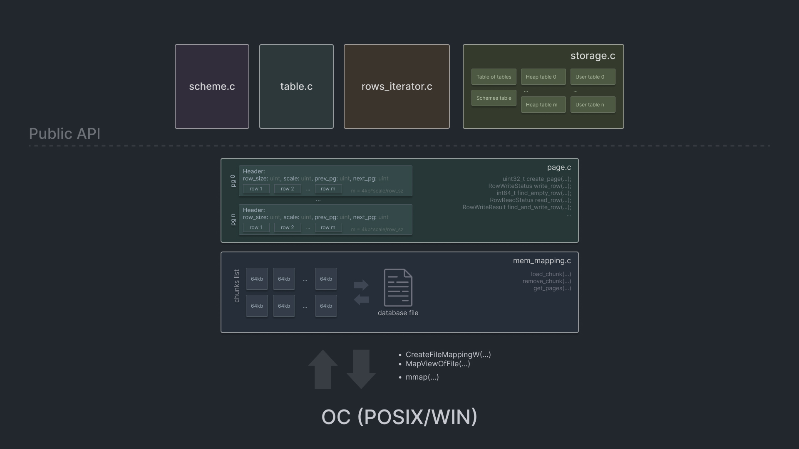

## About
Database written from scratch in C with memory mapping 
as a main way to work with memory.

### Features
- Insert
- Update
- Delete
- Iterate
- Apply complex data filters (like join and where in sql)

### Complexity constraints
- O(n) for select operation
- O(n*m) -> O(n+m) for update and delete, where n - elements in the table, 
m - affected elements
- O(1) for insert operation

## Architecture

if you're interested, you can explore algorithms and data structures in details
by reading the source code.

## Usage
```c
Storage* storage = init_storage("./dbfile");

OpenedTable table;
open_table(storage, "my_table", &table);

RowsIterator* iter = create_rows_iterator(storage, table);
// optional filter
float bound = 240;
rows_iterator_add_filter(iter, greater_filter, &bound, "field_name");  

while (rows_iterator_next(iter) == REQUEST_ROW_FOUND) {
    printf("%f, %d, %s, %hu\n", *(float*)iter->row[0], *(int*)iter->row[1],
           (char*)iter->row[2], *(uint16_t*)iter->row[0]);
}
rows_iterator_free(iter);
```
[Complete CRUD example](src/examples/crud.c)

## Stress tests
*<< link to the test results will be here >>*

## Build
Following commands produce library ```libdb-api.a``` to work with and two binaries to test operability of the build.
```shell
~ cmake -Bbuild
~ cmake --build build
```